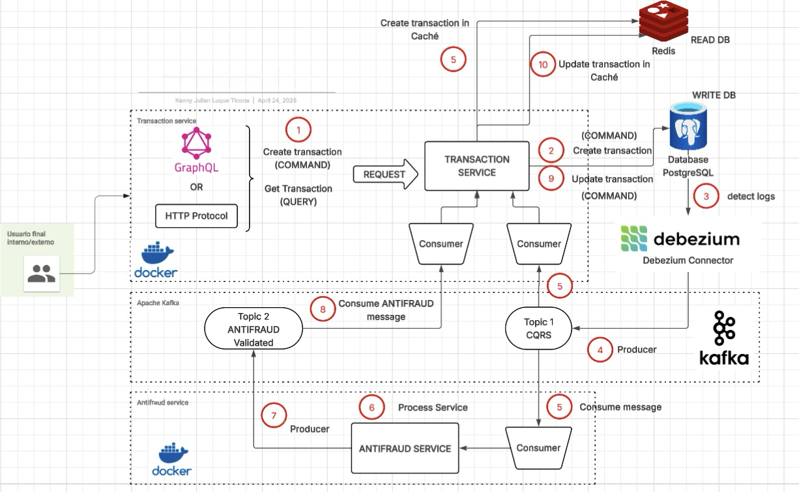

# Transaction Microservices Project (CQRS/EDA)

This repository contains a sample microservices-based system for managing financial transactions, implementing CQRS and EDA patterns using NestJS, Kafka, Debezium, PostgreSQL, Redis, and GraphQL.

## Overview

The system is composed of:

* **Transaction Service:** Handles the creation and querying of transactions GraphQL API and HTTP REST API. Uses PostgreSQL as the Write DB and Redis as the Read Cache.
* **AntiFraud Service:** Validates transactions based on simple rules (event-driven via Kafka).
* **Infrastructure:** PostgreSQL, Redis, Kafka, Zookeeper, Kafka Connect with Debezium (managed via Docker Compose).

### Handling High Volume and Concurrency

To address high-volume scenarios with concurrent reads and writes, this architecture implements the following key strategies:

* **CQRS (Command Query Responsibility Segregation) Pattern:**
    * **Writes (Commands):** Target a PostgreSQL database, optimized for transactional integrity (ACID).
    * **Reads (Queries):** Served exclusively from an in-memory Redis cache, optimized for very high speed and low latency.
    * This separation allows optimizing and scaling read and write workloads independently, reducing contention.

* **Asynchronous and Event-Driven Processing:**
    * The Redis cache (Read Model) is updated asynchronously via events consumed from Kafka (originating from Debezium and the AntiFraud service).
    * This decouples write/update operations from reads, improving responsiveness and resilience.
    * **Eventual consistency** is achieved.

* **Independent Scalability:**
    * **Reads (Redis):** Can be scaled horizontally using Redis Cluster.
    * **Writes (PostgreSQL):** Can be scaled vertically or horizontally using techniques like partitioning or sharding.
    * **Event Processing (Kafka/Consumers):** Can be scaled by increasing Kafka topic partitions and the number of consumer microservice instances (Transaction Service, AntiFraud Service).

## Prerequisites

Make sure you have the following installed on your local machine:

* Git  
* Docker ([https://docs.docker.com/get-docker/](https://docs.docker.com/get-docker/))  
* Docker Compose ([https://docs.docker.com/compose/install/](https://docs.docker.com/compose/install/))  
* Node.js (v20+ or the version specified in `.nvmrc` / `package.json`)  
* pnpm (`npm install -g pnpm` or your preferred method)


## Architecture Diagram

Below is the architecture diagram for the system:




## 🚀 Quick Start (Local Development)

Follow these steps to spin up the entire environment:

## 1. Clone the repository (replace with your actual repository URL)
git clone <URL_DEL_REPOSITORIO>
cd <NOMBRE_DEL_REPOSITORIO>

## 2. Configure Environment Variables
    MANUALLY: Copy/create the necessary .env files from .env.example files:
    - transaction_service/.env
    - antifraud_service/.env
    - docker/.env
    Adjust settings inside these files if needed (ports, credentials, Kafka topics, etc.).

## 4. Navigate to the Docker directory
cd docker

## 5. Build images and start all services
```bash
docker compose build --no-cache && docker compose up
```

## 6. Wait for Kafka Connect to be ready (can take 30s to a few minutes)

## 7. Register the Debezium connector 
./scripts/init-debezium.sh

## 8. Verify Connectors
curl http://localhost:8083/connector-plugins | jq

## 9. Check status
docker ps
