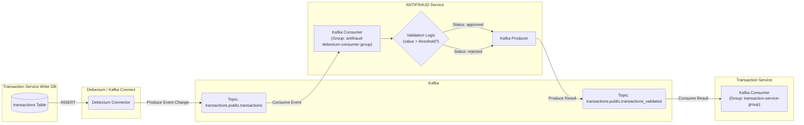

# Anti-Fraud Validation Service v1.0.0

## Description

The Anti-Fraud Validation Service is a specialized microservice whose sole responsibility is to evaluate newly created financial transactions and determine whether they should be approved or rejected based on a simple value threshold rule. It operates asynchronously and is fully event-driven.

## Architecture and Technical Details

- **Framework:** NestJS (Node.js, TypeScript)  
- **API:** **Does not expose an external API.** Operates solely through Kafka events.  
- **Messaging / Event Streaming:** Apache Kafka  
- **Event Source:** Debezium (consuming change events from DB logs via Kafka)  
- **Patterns:** Event-Driven Architecture (EDA), Microservices  
- **Package Manager:** pnpm (or npm/yarn depending on your project)

## Prerequisites

- Docker and Docker Compose  
- Node.js (v20 or higher recommended)  
- pnpm (or npm/yarn)  
- Git  
- (Requires the base ecosystem — Kafka, Zookeeper, Debezium/Connect — to be running, typically started from the main `docker-compose.yml`).

## Interaction and Flow (Event-Driven)

This service does **not** have a REST or GraphQL API. Its operation is as follows:

### 1. Consumes Events

Continuously listens to the Kafka topic `KAFKA_TOPIC_TRANSACTION_DEBEZIUM` (e.g., `transactions.public.transactions`) using its `group.id` (`KAFKA_CONSUMER_GROUP_ID`). It expects creation events (`__op: 'c'`) generated by Debezium from the transactions database.

#### Expected Payload (Example):

```json
{
  "id": "7d435656-e4f6-4b73-83bd-1d3886960039",
  "transactionExternalId": "7aed7998-0170-4284-b867-10e882629776",
  "accountExternalIdDebit": "8e8fd6b4-93c1-4eca-b260-d09cc3e33865",
  "accountExternalIdCredit": "8e8fd6b4-63c1-4eca-b260-d09cc3e33864",
  "transferTypeId": 1,
  "value": 300,
  "status": "pending",
  "createdAt": "2025-04-24T16:30:15.384447Z",
  "updatedAt": "2025-04-24T16:30:15.384447Z",
  "__op": "c",
  "__table": "transactions",
  "__source_ts_ms": 1745512215399
}
```

### 2. Processes Transactions

For each received creation event:

- Extracts the `transaction_external_id` and `value`.
- Compares the `value` against the `ANTIFRAUD_THRESHOLD`.
- Determines the status:
  - `approved` if `value <= threshold`
  - `rejected` if `value > threshold`

### 3. Produces Results

Publishes a new message to the Kafka topic `KAFKA_TOPIC_TRANSACTION_VALIDATED` (e.g., `transactions.public.transactions_validated`).

#### Produced Payload (Example):

```json
{
  "transactionExternalId": "...",
  "status": "approved" // or "rejected"
}
```

## Anti-Fraud Validation Flow Diagram


